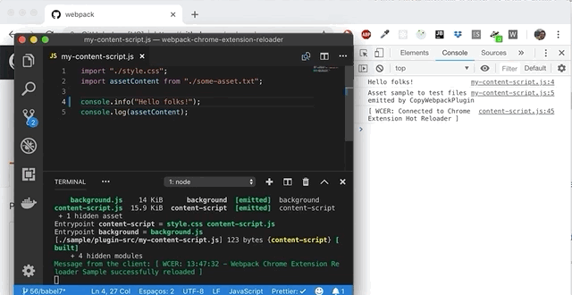

# Webpack Chrome Extension Reloader
A Webpack plugin to enable hot reloading while developing Chrome extensions.

<div align="center">
  <a href="https://github.com/webpack/webpack">
    
  </a>
  <br>
  <br>
</div>
  
[](https://badge.fury.io/js/webpack-chrome-extension-reloader)
[](https://travis-ci.org/rubenspgcavalcante/webpack-chrome-extension-reloader)
[](https://www.codacy.com/app/rubenspgcavalcante/webpack-chrome-extension-reloader?utm_source=github.com&amp;utm_medium=referral&amp;utm_content=rubenspgcavalcante/webpack-chrome-extension-reloader&amp;utm_campaign=Badge_Grade) [](https://greenkeeper.io/)

## Installing

npm
```
npm install webpack-chrome-extension-reloader --save-dev
```

yarn 
```
yarn add webpack-chrome-extension-reloader --dev
```

## Solution for ...
Have your ever being annoyed while developing a Google Chrome extension, and being unable to use
webpack-hot-server because it's not a web app but a browser extension?

Well, now you can do hot reloading!



## What it does?
Basically something similar to what the webpack hot reload middleware does. When you change the code and the webpack
trigger and finish the compilation, your extension is notified and then reloaded using the chrome.runtime API.  Check out
[Hot reloading Chrome extensions using Webpack](https://medium.com/front-end-hacking/hot-reloading-extensions-using-webpack-cdfa0e4d5a08) for more background.

## How to use
### Using as a plugin
Add `webpack-chrome-extension-reloader` to the plugins section of your webpack configuration file.
```js
const ChromeExtensionReloader  = require('webpack-chrome-extension-reloader');

plugins: [
    new ChromeExtensionReloader()
]
```

You can also set some options (the following are the default ones):
```js
entry: {
    'content-script': './my-content-script.js',
    background: './my-background-script.js'
},
//...
plugins: [
    new ChromeExtensionReloader({
      port: 9090, // Which port use to create the server
      reloadPage: true, // Force the reload of the page also
      entries: { // The entries used for the content/background scripts
        contentScript: 'content-script', // Use the entry names, not the file name or the path
        background: 'background' // *REQUIRED
      }
    })
]
```

And then just run your application with Webpack in watch mode:
```bash
NODE_ENV=development webpack --config myconfig.js --watch
```

**Important**: You need to run with `--watch`, as the plugin will be able to sign the extension 
only if webpack triggers the rebuild.

### Multiple Content Script support
If you use more than one content script in your extension, like:
```js
entry: {
    'my-first-content-script': './my-first-content-script.js',
    'my-second-content-script': './my-second-content-script.js',
    // and so on ...
    background: './my-background-script.js'
}
```

You can use the `entries.contentScript` options as an array:
```js
plugins: [
    new ChromeExtensionReloader({
      entries: { 
        contentScript: ['my-first-content-script', 'my-second-content-script', /* and so on ... */],
        background: 'background'
      }
    })
]
```

### CLI
If you don't want all the plugin setup, you can just use the client that comes with the package.  
You can use by intalling the package globably, or directly using `npx`

```bash
npx wcer
```
If you run directly, it will use the  default configurations, but if you want to customize
you can call it with the following options:
```bash
npx wcer --config wb.config.js --port 9080 --no-page-reload --content-script my-content.js --background bg.js 
```
If you have **multiple** content scripts, just use comma (with no spaces) while passing the option
```bash
npx wcer --content-script my-first-content.js,my-second-content.js,my-third-content.js 
```

### Client options

|        name        |    default        |                               description                         |
|--------------------|-------------------|-------------------------------------------------------------------|
| --help             |                   | Shows this help                                                   |
| --config           | webpack.config.js | The webpack configuration file path                               |
| --port             | 9090              | The port to run the server                                        |
| --content-script   | content-script    | The **entry/entries** name(s) for the content script(s)           |
| --background       | background        | The **entry** name for the background script                      |
| --no-page-reload   |                   | Disable the auto reloading of all **pages** which runs the plugin |

Every time webpack triggers a compilation, the extension reloader are going to do the hot reload :)  
**Note:** the plugin only works on **development** mode, so don't forget to set the NODE_ENV before run the command above

### Contributing
Please before opening any **issue** or **pull request** check the [contribution guide](/.github/CONTRIBUTING.MD).

### Building and Testing
Inside this repository have an example plugin, so you can test and see it working
After clone the repo, run:  
```
yarn build
```

 And then run:  
 ```
 yarn sample
 ```
 
 This will make the webpack run in watch mode for the sample plugin source and output the built files on the "dist"
 directory.
 Load the extension **(the files in "sample/dist" directory)** in Chrome using the "load unpacked extension", open a 
 new tab in any site and open the developer panel on it. Watch the dev. tools console tab, and do some changes on 
 the background or content script. Voila!

**Note:**
You must have both background and content scripts for this plugin to work, and they must be specified in separate `entry` chunks
in your webpack config.

The reloading script will be injected only on the main entries chunks (in background and content script). Any other
chunks will be ignored.

### License
This project is under the [MIT LICENSE](http://opensource.org/licenses/MIT)
